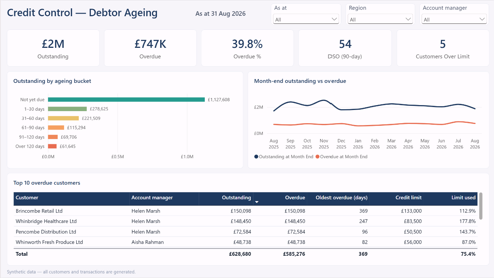
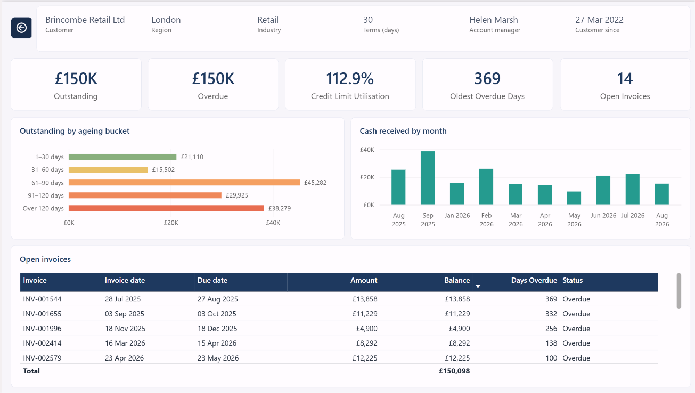
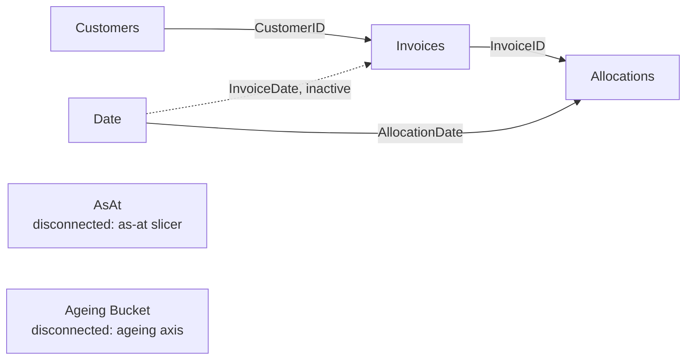

# Credit Control — Debtor Ageing (Power BI)

A Power BI report for credit control: what customers owe, how much is overdue, how old the debt is
and who needs chasing, at any as-at date. It is built as a Power BI Project (PBIP with a TMDL
semantic model) on a synthetic sales ledger produced by the Python generator in this repository.

> **All data is synthetic.** Every customer, invoice and receipt is generated by
> `data-generator/generate.py`. No real companies or transactions.





## Model

Star schema, Import mode. Arrows show filter direction.



- **AsAt** and **Ageing Bucket** have no relationships. Measures read them directly, so one as-at
  slicer re-dates every balance and the ageing axis needs no link to the facts.
- The Date → Invoices relationship is inactive: with Invoices → Allocations in place, a second active
  date path to Allocations would be ambiguous.

## Two DAX patterns

### 1. As-at snapshot balances

- A balance is a snapshot at a date, not a sum of whatever dates a visual happens to filter.
- `As At Date` is the slicer selection, or the month end of the latest activity when nothing is selected.
- Each balance removes the Date filter, so axes and slicers on Date cannot distort it.
- It then keeps invoices raised, and receipts allocated, on or before the as-at date.
- Outstanding is simply invoiced to date minus allocated to date.
- The same pattern with the axis month end as the date gives the month-end trend.

```dax
Invoiced to Date =
VAR AsAtDate = [As At Date]
RETURN
    CALCULATE ( SUM ( Invoices[Amount] ), REMOVEFILTERS ( 'Date' ), Invoices[InvoiceDate] <= AsAtDate )

Outstanding = [Invoiced to Date] - [Allocated to Date]
```

### 2. Dynamic ageing

- Ageing is calculated at query time for the as-at date, not stored on the invoice.
- A virtual table holds each invoice raised by the as-at date with its balance and days past due.
- The balance deducts only receipts allocated on or before the as-at date.
- The bucket in context supplies a day range (`MinDays` to `MaxDays`) from the Ageing Bucket table.
- Open invoices whose days fall inside that range are summed; at total level every bucket applies.
- Overdue and Not Yet Due reuse the same measure with a bucket filter.

```dax
Outstanding by Bucket =
VAR AsAtDate = [As At Date]
VAR MinDays = MIN ( 'Ageing Bucket'[MinDays] )
VAR MaxDays = MAX ( 'Ageing Bucket'[MaxDays] )
VAR OpenItems =
    CALCULATETABLE (
        ADDCOLUMNS (
            SUMMARIZE ( Invoices, Invoices[InvoiceID], Invoices[DueDate], Invoices[Amount] ),
            "@Balance", Invoices[Amount] - CALCULATE ( SUM ( Allocations[Amount] ), Allocations[AllocationDate] <= AsAtDate ),
            "@Days", INT ( AsAtDate - Invoices[DueDate] )
        ),
        REMOVEFILTERS ( 'Date' ),
        Invoices[InvoiceDate] <= AsAtDate
    )
RETURN
    SUMX ( FILTER ( OpenItems, [@Balance] > 0.005 && [@Days] >= MinDays && [@Days] <= MaxDays ), [@Balance] )
```

## Repository

| Path | Contents |
| --- | --- |
| `data-generator/` | `generate.py` (pandas, numpy; fixed seed) and `requirements.txt` |
| `data/` | Customers, invoices, allocations, and `expected_ageing.csv`: an independent pandas ageing used to reconcile the DAX to the penny |
| `CreditControlDemo.pbip` | Power BI Project entry point |
| `CreditControlDemo.SemanticModel/` | TMDL semantic model: tables, relationships, measures |
| `CreditControlDemo.Report/` | Report definition: Credit Control, Customer (drillthrough) and About pages |

## How to run

1. Optional, to regenerate the data: `pip install -r data-generator/requirements.txt`, then
   `python data-generator/generate.py`. Output is identical on every run and the script prints its sanity checks.
2. Open `CreditControlDemo.pbip` in Power BI Desktop.
3. Transform data → Edit parameters → set `DataFolder` to the full path of this repository's `data` folder → Refresh.
4. Reconcile: the TOTAL rows in `data/expected_ageing.csv` match the report as at 31 Aug 2026 and 31 Mar 2026.

## Next steps

- Row-level security by account manager.
- Fabric deployment pipeline (development → test → production) driven from this repository.

## Author

Ravi Jain — [github.com/raviwax](https://github.com/raviwax)
